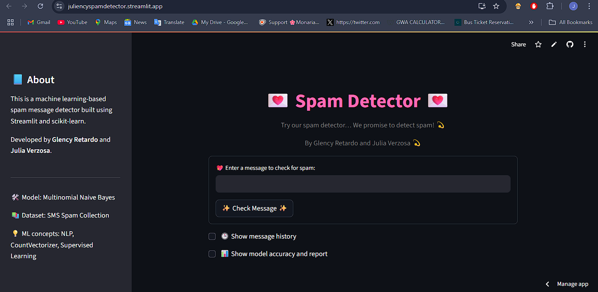
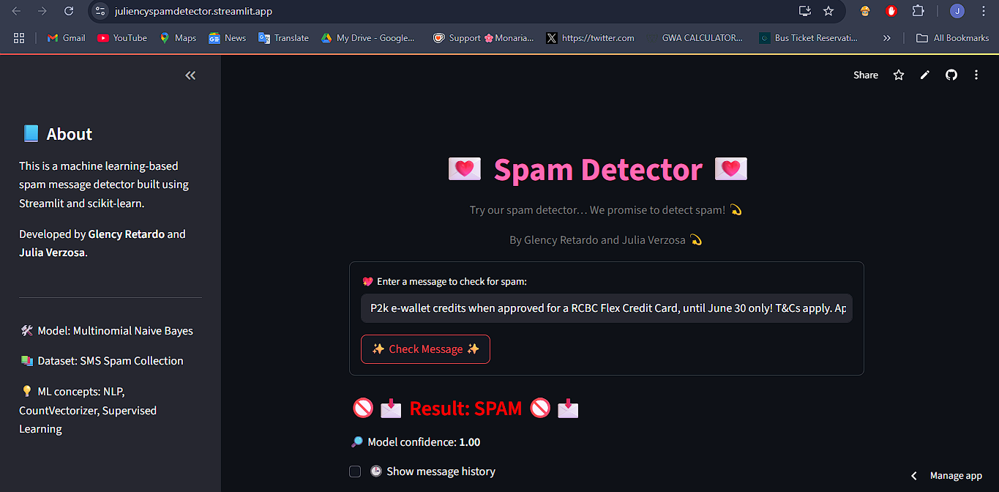

# 💌 Spam Detector Web Application

This is a simple and interactive **Spam Detection Web App** built using **Python**, **Streamlit**, and **scikit-learn**. The app allows users to enter any message and instantly find out whether it’s **spam** or **ham** (not spam), using a machine learning model trained on real SMS data.

> Developed by Julia Verzosa and Glency Retardo  
> BS Computer Science — University of Mindanao

---

## 🧠 About the App

This application demonstrates a real-world use case of Natural Language Processing (NLP) through spam detection. It uses **Multinomial Naive Bayes**, a popular supervised learning algorithm for text classification, and presents predictions in a friendly, responsive user interface.

---

## ✨ Features

- 🔍 Real-time message classification (spam or ham)
- 🎨 User-friendly interface with soft visuals
- 🧠 Built-in model accuracy report toggle
- 📊 Confidence score displayed for every prediction
- 🕒 Message history log (last 5 messages shown)
- 🌸 Clean design styled with CSS and emojis

---

## 🛠 Tech Used

- **Python 3**
- **pandas** for data preprocessing
- **scikit-learn** for ML modeling (MultinomialNB)
- **Streamlit** for building the web interface
- **CountVectorizer** for text vectorization

---


## 📂 Dataset

- Dataset used: [SMS Spam Collection](https://www.kaggle.com/datasets/uciml/sms-spam-collection-dataset)
- Contains 5,000+ labeled SMS messages (`spam` or `ham`)
- Preprocessing steps: column renaming and lowercasing text

---

## 🚀 Installation & Setup Instructions

Make sure Python 3.8+ is installed. Then:

```bash
# 1. Clone the repository
git clone https://github.com/yourusername/spam-detector.git
cd spam-detector

# 2. Install the dependencies
pip install -r requirements.txt

# 3. Run the application
streamlit run app.py

``` 

---


## 📸 Screenshots

Here are sample screenshots of the Spam Detector app in action:

### Main Interface


### Prediction Result - HAM


### Prediction Result - SPAM


---

